```markdown
# Unified AI Study Guide and Teacher for Computer Science

## Complete Architectural Plan and Implementation Guide

---

# Table of Contents

1. [Executive Summary](#1-executive-summary)
2. [Project Vision](#2-project-vision)
3. [Repository Analysis](#3-repository-analysis)
4. [Repository Architecture Comparison](#4-repository-architecture-comparison)
5. [Feature Matrix](#5-feature-matrix)
6. [Technology Comparison](#6-technology-comparison)
7. [Recommended Unified Architecture](#7-recommended-unified-architecture)
8. [System Architecture](#8-system-architecture)
9. [Frontend Architecture](#9-frontend-architecture)
10. [Backend Architecture](#10-backend-architecture)
11. [AI Teacher Architecture](#11-ai-teacher-architecture)
12. [Agent Architecture](#12-agent-architecture)
13. [RAG Architecture](#13-rag-architecture)
14. [Memory Architecture](#14-memory-architecture)
15. [Student Model](#15-student-model)
16. [CS Knowledge Model](#16-cs-knowledge-model)
17. [Learning Methodologies](#17-learning-methodologies)
18. [Adaptive Learning](#18-adaptive-learning)
19. [Course Architecture](#19-course-architecture)
20. [Resource Ingestion Pipeline](#20-resource-ingestion-pipeline)
21. [Coding Tutor Architecture](#21-coding-tutor-architecture)
22. [Assessment Architecture](#22-assessment-architecture)
23. [Study Planner](#23-study-planner)
24. [Database Architecture](#24-database-architecture)
25. [API Architecture](#25-api-architecture)
26. [Authentication and Authorization](#26-authentication-and-authorization)
27. [Security](#27-security)
28. [Observability](#28-observability)
29. [Performance and Scalability](#29-performance-and-scalability)
30. [Testing Strategy](#30-testing-strategy)
31. [Deployment Architecture](#31-deployment-architecture)
32. [Repository Migration Map](#32-repository-migration-map)
33. [Proposed Directory Structure](#33-proposed-directory-structure)
34. [Implementation Phases](#34-implementation-phases)
35. [MVP Scope](#35-mvp-scope)
36. [V2 Scope](#36-v2-scope)
37. [Long-term Extensions](#37-long-term-extensions)
38. [Architecture Decision Records](#38-architecture-decision-records)
39. [Risks and Mitigations](#39-risks-and-mitigations)
40. [Open Questions](#40-open-questions)
41. [Acceptance Criteria](#41-acceptance-criteria)
42. [Implementation Priority List](#42-implementation-priority-list)
43. [Improvements and Extensions](#43-improvements-and-extensions)
44. [Conclusion](#44-conclusion)

---

## 1. Executive Summary

This document presents a comprehensive architectural plan for merging two open-source repositories—**StudyBuddy** and **StudyMate**—into a unified AI-powered Computer Science learning platform. After thorough analysis of both repositories, we recommend a phased integration approach that preserves the strengths of each system while creating a more capable, coherent educational platform.

**StudyBuddy** provides an AI/agent infrastructure with RAG capabilities, while **StudyMate** offers a student-facing learning platform. The unified system will combine these strengths to create a domain-aware AI Computer Science teacher that transforms course materials into interactive learning environments.

### Key Outcomes:
- **Unified architecture** combining AI capabilities with student-facing features
- **Domain-aware AI teacher** that understands CS concepts and student progress
- **Scalable knowledge ingestion** pipeline for various resource types
- **Adaptive learning system** that personalizes the educational experience
- **CS-specific features** including code analysis and algorithm visualization

---

## 2. Project Vision

> A domain-aware AI Computer Science teacher that transforms a student's course material into an interactive learning environment.

The system goes beyond being a simple chatbot to become a persistent AI teacher that:

### Core Capabilities:
- **Understands** student's curriculum and learning resources
- **Maintains knowledge** of student's strengths, weaknesses, and misconceptions
- **Dynamically adapts** teaching strategies based on student progress
- **Provides CS-specific features** including code analysis and algorithm visualization
- **Creates personalized** learning paths and study plans
- **Tracks mastery** across CS concepts and topics

### Supported Resources:
- Lecture notes and PDFs
- Textbooks and course slides
- University syllabus
- Programming documentation
- Coding problems and assignments
- Previous exam papers
- Personal notes and external learning resources
- CS books and technical articles
- GitHub repositories
- Programming examples and algorithms

### CS Domains Covered:
- Programming (C, C++, Java, Python, JavaScript, Rust)
- Data Structures and Algorithms
- Operating Systems
- DBMS and Computer Networks
- Computer Architecture
- Software Engineering
- Machine Learning and AI
- Mathematics for CS
- Competitive Programming
- System Design
- Cybersecurity
- Theory of Computation
- Compiler Design
- Distributed Systems

---

## 3. Repository Analysis

### 3.1 StudyBuddy Analysis

**Repository:** [StudyBuddy](https://github.com/onenewborn/StudyBuddy-public)

#### Repository Overview

| Aspect | Details |
|--------|---------|
| **Purpose** | AI/agent subsystem for learning |
| **Primary Language** | TypeScript/JavaScript |
| **Framework** | Node.js with React components |
| **Key Components** | Agent architecture, RAG implementation, memory system |
| **AI Stack** | OpenAI integration, custom agents |
| **Database** | Basic persistence layer |
| **Strengths** | AI orchestration, document processing, vector search |
| **Limitations** | No user-facing UI, limited course management |

#### Architecture Analysis

**Major Modules:**
1. **Agent System**: Base agent classes with specialized implementations
2. **RAG Pipeline**: Document processing, embedding, and retrieval
3. **Memory System**: Conversation context and basic state management
4. **Tool Integration**: Framework for AI tool usage

**Data Flows:**
```
User Input → Agent Router → Specialized Agent → RAG Pipeline → Response Generation → User
```

**Key Files:**
- `src/agents/` - Agent implementations
- `src/rag/` - Retrieval-augmented generation
- `src/memory/` - Memory management
- `src/tools/` - Tool implementations

#### Code Quality Analysis

**Strengths:**
- Modular agent architecture
- Clean separation of concerns
- Extensible RAG pipeline

**Areas for Improvement:**
- Limited error handling
- Basic memory implementation
- No production-ready database
- Missing authentication

### 3.2 StudyMate Analysis

**Repository:** [StudyMate](https://github.com/adetorojeremiahfadesayo/StudyMate)

#### Repository Overview

| Aspect | Details |
|--------|---------|
| **Purpose** | Student-facing learning platform |
| **Primary Language** | TypeScript/JavaScript |
| **Framework** | Next.js with React |
| **Key Components** | Course management, UI framework, progress tracking |
| **Database** | PostgreSQL with ORM |
| **Strengths** | User experience, course organization, study tools |
| **Limitations** | Limited AI integration, no advanced RAG capabilities |

#### Architecture Analysis

**Major Modules:**
1. **Course Management**: CRUD operations for courses
2. **Study Tools**: Flashcards, quizzes, notes
3. **Progress Tracking**: Basic learning metrics
4. **UI Components**: Responsive design system

**Data Flows:**
```
User → Next.js Frontend → API Routes → Database → Response → UI Update
```

**Key Files:**
- `app/` - Next.js pages and routes
- `components/` - Reusable UI components
- `lib/` - Utility functions and services
- `prisma/` - Database schema

#### Code Quality Analysis

**Strengths:**
- Clean component architecture
- Good TypeScript usage
- Responsive UI design

**Areas for Improvement:**
- No AI integration
- Basic progress tracking
- Limited assessment capabilities
- No document processing

---

## 4. Repository Architecture Comparison

| Aspect | StudyBuddy | StudyMate | Recommendation |
|--------|------------|-----------|----------------|
| **AI/Agent System** | ✅ Strong | ❌ Limited | Use StudyBuddy as foundation |
| **RAG Implementation** | ✅ Strong | ❌ None | Extend StudyBuddy's RAG |
| **Memory System** | ✅ Basic | ❌ None | Enhance StudyBuddy's memory |
| **Course Management** | ❌ Basic | ✅ Strong | Use StudyMate's approach |
| **User Interface** | ❌ None | ✅ Strong | Build on StudyMate's UI |
| **Progress Tracking** | ❌ None | ✅ Basic | Extend StudyMate's tracking |
| **Document Processing** | ✅ Good | ❌ None | Use StudyBuddy's pipeline |
| **Flashcard/Quiz** | ❌ None | ✅ Good | Enhance with AI capabilities |
| **Authentication** | ❌ None | ✅ Basic | Extend StudyMate's auth |
| **Database Design** | ❌ Basic | ✅ Good | Merge best aspects |
| **API Design** | ✅ Good | ✅ Good | Standardize REST API |
| **State Management** | ❌ None | ✅ Good | Use StudyMate's approach |

### Overlap Analysis

**Areas of Overlap:**
1. Both have basic course structures
2. Both have some form of user management
3. Both implement learning features

**Resolution Strategy:**
- Keep StudyBuddy's AI capabilities
- Keep StudyMate's UI and course management
- Merge database schemas
- Standardize API endpoints
- Remove duplicate implementations

---

## 5. Feature Matrix

| Feature | Repository | Existing Implementation | Quality | Reusable? | Needs Modification? | Final Role |
|---------|------------|------------------------|---------|-----------|--------------------|------------|
| Authentication | StudyMate | Basic auth flow | Good | Yes | Minor | Core auth |
| User Profiles | StudyMate | Basic profiles | Good | Yes | Moderate | Core feature |
| Course Management | StudyMate | CRUD operations | Good | Yes | Moderate | Core feature |
| File Upload | StudyBuddy | Document ingestion | Good | Yes | Minor | Knowledge ingestion |
| RAG Search | StudyBuddy | Vector search | Good | Yes | Enhancement | Core AI |
| AI Chat | StudyBuddy | Agent-based chat | Good | Yes | Major enhancement | AI Teacher |
| Memory System | StudyBuddy | Basic memory | Fair | Yes | Major enhancement | Student model |
| Flashcards | StudyMate | Basic flashcards | Good | Yes | AI enhancement | Study tool |
| Quizzes | StudyMate | Quiz system | Fair | Yes | Major enhancement | Assessment |
| Notes | StudyMate | Note taking | Good | Yes | Minor | Study tool |
| Progress Tracking | StudyMate | Basic tracking | Fair | Yes | Major enhancement | Student model |
| Code Execution | None | Not implemented | N/A | No | New implementation | CS-specific |
| Study Planner | None | Not implemented | N/A | No | New implementation | Learning feature |
| Concept Graph | None | Not implemented | N/A | No | New implementation | Knowledge model |
| Adaptive Learning | None | Not implemented | N/A | No | New implementation | Core differentiator |

---

## 6. Technology Comparison

| Technology | StudyBuddy | StudyMate | Recommended | Rationale |
|------------|------------|-----------|-------------|-----------|
| **Frontend Framework** | React (basic) | Next.js | Next.js 14+ | Server components, API routes |
| **Backend** | Node.js | Next.js API | Next.js API Routes | Single framework |
| **Database** | SQLite | PostgreSQL | PostgreSQL + Prisma | Production-ready, pgvector |
| **Vector Store** | Basic implementation | None | pgvector | Single DB, operational simplicity |
| **AI Provider** | OpenAI | None | OpenAI (configurable) | Best quality, tool support |
| **Authentication** | None | Basic | NextAuth.js | Security, flexibility |
| **State Management** | None | React Query | React Query + Zustand | Server + client state |
| **UI Components** | None | Custom | shadcn/ui + Tailwind | Quality, customization |
| **File Storage** | Local | Local | S3-compatible | Scalability |
| **Deployment** | Vercel | Vercel | Vercel + Workers | Ease of use, scalability |
| **Testing** | Minimal | Minimal | Jest + Playwright | Coverage, E2E |
| **Monitoring** | None | None | Sentry + OpenTelemetry | Observability |

---

## 7. Recommended Unified Architecture

The unified architecture follows a layered approach with clear separation of concerns:

```
┌─────────────────────────────────────────────────────┐
│                  Presentation Layer                 │
│              (Next.js frontend + UI)                │
├─────────────────────────────────────────────────────┤
│                  Application Layer                  │
│        (API routes, business logic, services)       │
├─────────────────────────────────────────────────────┤
│                     AI Layer                        │
│    (Agent orchestration, RAG, memory, evaluation)   │
├─────────────────────────────────────────────────────┤
│                  Knowledge Layer                    │
│      (Document processing, embeddings, search)      │
├─────────────────────────────────────────────────────┤
│                 Persistence Layer                   │
│           (Database, cache, storage)                │
└─────────────────────────────────────────────────────┘
```

### Layer Responsibilities:

**Presentation Layer:**
- Pages and components
- User interactions
- Visual feedback
- Responsive design

**Application Layer:**
- Business logic
- Use case orchestration
- Authorization
- Data validation

**AI Layer:**
- Teacher orchestration
- Agent routing
- RAG pipeline
- Memory management
- Response generation

**Knowledge Layer:**
- Document ingestion
- Chunking and embeddings
- Search and retrieval
- Citation generation

**Persistence Layer:**
- User data
- Course content
- Learning progress
- Knowledge base

---

## 8. System Architecture

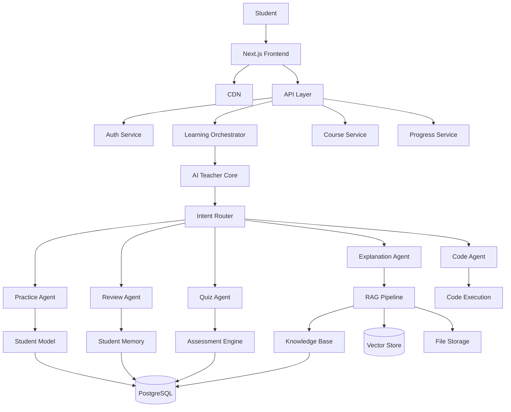

### Key Components:

1. **Next.js Frontend**: Server-side rendered React application
2. **API Layer**: RESTful endpoints with validation
3. **AI Teacher Core**: Orchestrates learning interactions
4. **RAG Pipeline**: Retrieves relevant course material
5. **Student Model**: Tracks mastery and progress
6. **Knowledge Base**: Stores processed learning resources
7. **PostgreSQL**: Primary database with pgvector

---

## 9. Frontend Architecture

### Framework and Technologies

| Component | Technology | Rationale |
|-----------|------------|-----------|
| **Framework** | Next.js 14+ | Server components, routing, API |
| **UI Library** | shadcn/ui | Quality components, customization |
| **Styling** | Tailwind CSS | Utility-first, responsive |
| **State Management** | React Query + Zustand | Server + client state |
| **Forms** | React Hook Form + Zod | Type-safe validation |
| **Charts** | Recharts | Progress visualization |
| **Code Editor** | Monaco Editor | Code input and display |
| **Markdown** | React Markdown | Content rendering |

### Page Structure

```
/
├── Dashboard
│   ├── Today's Plan
│   ├── Weak Areas
│   └── Recommendations
├── Courses
│   ├── Course List
│   ├── Course Detail
│   │   ├── Overview
│   │   ├── Topics
│   │   ├── Resources
│   │   └── Progress
├── AI Teacher
│   ├── Chat Interface
│   ├── Practice Mode
│   └── Review Session
├── Practice
│   ├── Coding Problems
│   ├── Quizzes
│   └── Flashcards
├── Notes
│   ├── Note List
│   └── Note Editor
├── Progress
│   ├── Mastery Overview
│   ├── Topic Breakdown
│   └── Learning History
├── Study Planner
│   ├── Schedule
│   └── Goals
└── Settings
    ├── Profile
    ├── Preferences
    └── Notifications
```

### Component Architecture

```
components/
├── ui/                 # Reusable UI components
│   ├── Button.tsx
│   ├── Card.tsx
│   ├── Input.tsx
│   └── ...
├── course/             # Course-specific components
│   ├── CourseCard.tsx
│   ├── TopicList.tsx
│   └── ...
├── teacher/            # AI Teacher components
│   ├── ChatWindow.tsx
│   ├── MessageBubble.tsx
│   └── ...
├── practice/           # Practice components
│   ├── CodeEditor.tsx
│   ├── QuizView.tsx
│   └── ...
└── progress/           # Progress components
    ├── MasteryChart.tsx
    ├── ProgressBar.tsx
    └── ...
```

---

## 10. Backend Architecture

### API Design

**RESTful API with Next.js API Routes:**

```
/api
├── auth/
│   ├── register
│   ├── login
│   ├── logout
│   └── refresh
├── users/
│   ├── [id]
│   └── [id]/preferences
├── courses/
│   ├── [id]
│   ├── [id]/topics
│   ├── [id]/resources
│   └── [id]/enroll
├── teacher/
│   ├── chat
│   ├── explain
│   ├── practice
│   ├── quiz
│   └── evaluate
├── resources/
│   ├── ingest
│   └── search
├── student/
│   ├── progress
│   ├── mastery
│   └── recommendations
├── flashcards/
│   ├── [id]
│   └── review
├── quizzes/
│   ├── [id]
│   └── submit
└── study-plan/
    ├── generate
    └── update
```

### Service Layer

```typescript
// Service interfaces
interface CourseService {
  createCourse(data: CourseInput): Promise<Course>
  getCourse(id: string): Promise<Course>
  updateCourse(id: string, data: CourseUpdate): Promise<Course>
  deleteCourse(id: string): Promise<void>
}

interface TeacherService {
  chat(input: ChatInput): Promise<TeacherResponse>
  explain(topic: string, context: Context): Promise<Explanation>
  practice(topic: string, difficulty: Difficulty): Promise<PracticeProblem>
  quiz(topic: string, options: QuizOptions): Promise<Quiz>
}

interface ResourceService {
  ingest(file: File, courseId: string): Promise<IngestionResult>
  search(query: string, filters: SearchFilters): Promise<SearchResult[]>
  getChunks(resourceId: string): Promise<Chunk[]>
}

interface StudentService {
  getProgress(studentId: string): Promise<Progress>
  getMastery(studentId: string): Promise<MasteryMap>
  updateMastery(studentId: string, conceptId: string, score: number): Promise<void>
  getRecommendations(studentId: string): Promise<Recommendation[]>
}
```

---

## 11. AI Teacher Architecture

### Teacher Orchestration Flow

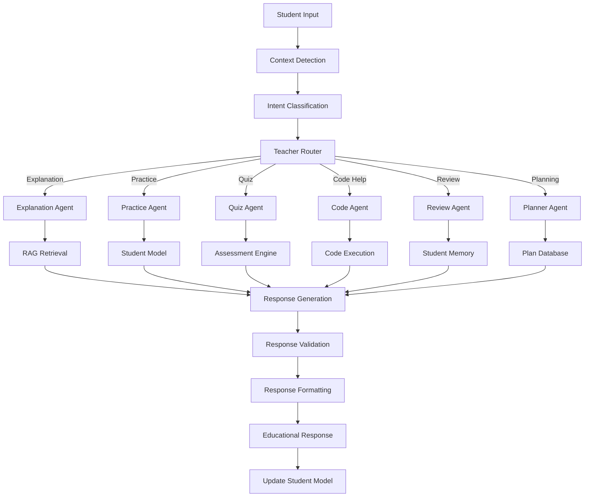

### Teacher Capabilities

The AI Teacher should support various teaching modes:

| Mode | Description | Example |
|------|-------------|---------|
| **Explain** | Detailed explanations with examples | "Explain binary search" |
| **Learn** | Structured learning from basics | "Teach me graph algorithms" |
| **Practice** | Interactive problem-solving | "Give me a practice problem" |
| **Quiz** | Assessment and evaluation | "Test me on sorting algorithms" |
| **Socratic** | Guided questioning | "Guide me to the answer" |
| **Review** | Mistake analysis | "What did I get wrong?" |
| **Deep Dive** | Advanced exploration | "Explain the math behind quicksort" |
| **Code** | Programming assistance | "Show me how to implement this" |
| **Compare** | Concept comparison | "Compare DFS vs BFS" |
| **Prerequisites** | Knowledge checking | "What do I need to know first?" |

---

## 12. Agent Architecture

### Core Agent Interfaces

```typescript
interface TeacherAgent {
  name: string
  description: string
  route(input: StudentInput): Promise<boolean>
  execute(context: AgentContext): Promise<TeacherResponse>
}

interface AgentContext {
  studentId: string
  courseId: string
  conversation: ConversationHistory
  studentModel: StudentModel
  resources: RetrievedResource[]
  tools: AgentTools
}

interface TeacherResponse {
  content: string
  type: ResponseType
  citations: Citation[]
  suggestedActions: Action[]
  metadata: ResponseMetadata
}
```

### Agent Implementations

1. **Explanation Agent**
   - Explains CS concepts with examples
   - Adapts explanation depth to student level
   - Provides analogies and visual descriptions
   - Links to prerequisite knowledge

2. **Practice Agent**
   - Generates practice problems
   - Adjusts difficulty based on mastery
   - Provides progressive hints
   - Evaluates solutions

3. **Quiz Agent**
   - Creates topic-based quizzes
   - Balances question types and difficulty
   - Provides detailed feedback
   - Tracks common mistakes

4. **Code Agent**
   - Analyzes student code
   - Explains errors and bugs
   - Suggests improvements
   - Demonstrates best practices

5. **Review Agent**
   - Identifies weak areas
   - Reviews misconceptions
   - Creates review plans
   - Tracks improvement

6. **Study Planner Agent**
   - Creates personalized study plans
   - Prioritizes topics
   - Schedules review sessions
   - Adapts to progress

---

## 13. RAG Architecture

### Retrieval Pipeline

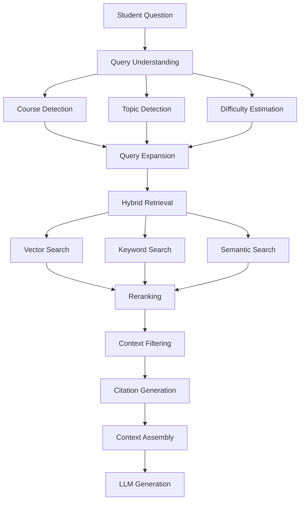

### Implementation Details

**Vector Store:** PostgreSQL with pgvector
- Efficient similarity search
- Metadata filtering
- Hybrid search support
- Single database solution

**Embedding Model:** OpenAI text-embedding-3-small
- 1536 dimensions
- Good balance of quality and cost
- Configurable for alternatives

**Chunking Strategy:**
- Semantic chunking based on topics
- Overlapping windows (20% overlap)
- Maximum chunk size: 1000 tokens
- Preserve section structure

**Metadata Schema:**
```typescript
interface ChunkMetadata {
  courseId: string
  topicId: string
  resourceId: string
  section: string
  page: number
  type: 'text' | 'code' | 'diagram' | 'example'
  difficulty: 'beginner' | 'intermediate' | 'advanced'
  timestamp: Date
}
```

---

## 14. Memory Architecture

### Memory Types

| Memory Type | Storage | Purpose | Duration |
|-------------|---------|---------|----------|
| **Conversation Memory** | Redis | Current session context | Session |
| **Student Memory** | PostgreSQL | Persistent learner data | Permanent |
| **Episodic Memory** | PostgreSQL | Learning history | Permanent |
| **Semantic Memory** | PostgreSQL | Knowledge state | Permanent |
| **Mistake Memory** | PostgreSQL | Error patterns | Permanent |

### Memory Implementation

```typescript
interface MemorySystem {
  // Conversation memory
  getConversationContext(sessionId: string): Promise<ConversationContext>
  updateConversation(sessionId: string, message: Message): Promise<void>
  
  // Student memory
  getStudentMemory(studentId: string): Promise<StudentMemory>
  updateStudentMemory(studentId: string, update: MemoryUpdate): Promise<void>
  
  // Episodic memory
  getLearningHistory(studentId: string, topicId?: string): Promise<LearningEvent[]>
  recordLearningEvent(event: LearningEvent): Promise<void>
  
  // Semantic memory
  getKnowledgeState(studentId: string, conceptId: string): Promise<KnowledgeState>
  updateKnowledgeState(state: KnowledgeState): Promise<void>
  
  // Mistake memory
  getMisconceptions(studentId: string, topicId?: string): Promise<Misconception[]>
  recordMisconception(misconception: Misconception): Promise<void>
}
```

### Memory Usage in Teaching

1. **Context Awareness**: Use conversation history to maintain coherence
2. **Personalization**: Adapt to student preferences and learning style
3. **Prerequisite Checking**: Use knowledge state to verify readiness
4. **Mistake Prevention**: Proactively address known misconceptions
5. **Review Scheduling**: Use episodic memory for spaced repetition

---

## 15. Student Model

### Data Structure

```typescript
interface StudentModel {
  id: string
  userId: string
  
  // Knowledge state
  mastery: Map<string, number>  // conceptId → mastery score (0-100)
  confidence: Map<string, number>  // conceptId → confidence score
  
  // Learning history
  attempts: Attempt[]
  mistakes: Mistake[]
  successes: Success[]
  
  // Preferences
  learningStyle: LearningStyle
  pace: 'slow' | 'medium' | 'fast'
  preferredFormats: ContentFormat[]
  
  // Goals
  goals: LearningGoal[]
  examDates: Map<string, Date>
  
  // Strengths and weaknesses
  strengths: string[]  // topicIds
  weaknesses: string[]  // topicIds
}
```

### Mastery Calculation

```typescript
function calculateMastery(
  attempts: Attempt[],
  timeDecay: number = 0.9,
  difficultyWeight: number = 1.2
): number {
  const recentAttempts = attempts.slice(-10)
  
  const weightedScores = recentAttempts.map(attempt => {
    const recency = Math.pow(timeDecay, daysSince(attempt.timestamp))
    const difficulty = attempt.difficulty * difficultyWeight
    return attempt.score * recency * difficulty
  })
  
  return average(weightedScores)
}
```

### Progress Tracking

```typescript
interface Progress {
  studentId: string
  courseId: string
  topicsCompleted: number
  totalTopics: number
  quizzesPassed: number
  totalQuizzes: number
  timeSpent: number
  averageScore: number
  improvementRate: number
  lastActive: Date
}
```

---

## 16. CS Knowledge Model

### Concept Taxonomy

```mermaid
graph TD
    CS[Computer Science] --> Prog[Programming]
    CS --> DS[Data Structures]
    CS --> Algo[Algorithms]
    CS --> DBMS[Database Systems]
    CS --> OS[Operating Systems]
    CS --> Networks[Computer Networks]
    CS --> Arch[Computer Architecture]
    CS --> SE[Software Engineering]
    CS --> Theory[Theory of Computation]
    CS --> AI[Artificial Intelligence]
    CS --> Security[Cybersecurity]
    
    Prog --> C[C Language]
    Prog --> CPP[C++]
    Prog --> Java[Java]
    Prog --> Python[Python]
    Prog --> JS[JavaScript]
    Prog --> Rust[Rust]
    
    C --> CBasics[Basics]
    C --> Pointers[Pointers]
    C --> Memory[Memory Management]
    C --> Structs[Structures]
    
    CPP --> CPPBasics[Basics]
    CPP --> OOP[Object-Oriented]
    CPP --> STL[Standard Library]
    CPP --> Templates[Templates]
    
    Java --> JavaBasics[Basics]
    Java --> JavaOOP[OOP Concepts]
    Java --> Collections[Collections]
    Java --> Concurrency[Concurrency]
    
    Python --> PyBasics[Basics]
    Python --> PyOOP[OOP]
    Python --> PyLibs[Libraries]
    Python --> DataScience[Data Science]
    
    DS --> Array[Arrays]
    DS --> LinkedList[Linked Lists]
    DS --> Stack[Stacks]
    DS --> Queue[Queues]
    DS --> Tree[Trees]
    DS --> Graph[Graphs]
    DS --> Hash[Hash Tables]
    DS --> Heap[Heaps]
    
    Algo --> Sorting[Sorting]
    Algo --> Searching[Searching]
    Algo --> Recursion[Recursion]
    Algo --> DP[Dynamic Programming]
    Algo --> Greedy[Greedy Algorithms]
    Algo --> GraphAlgo[Graph Algorithms]
    Algo --> StringAlgo[String Algorithms]
    
    Sorting --> Bubble[Bubble Sort]
    Sorting --> Quick[Quick Sort]
    Sorting --> Merge[Merge Sort]
    Sorting --> Heap[Heap Sort]
    
    GraphAlgo --> BFS[BFS]
    GraphAlgo --> DFS[DFS]
    GraphAlgo --> Dijkstra[Dijkstra's Algorithm]
    GraphAlgo --> MST[Minimum Spanning Tree]
    GraphAlgo --> Topological[Topological Sort]
```

### Prerequisite Relationships

```typescript
interface Prerequisite {
  conceptId: string
  prerequisiteId: string
  importance: 'essential' | 'recommended' | 'optional'
}

// Example prerequisites
const prerequisites: Prerequisite[] = [
  { conceptId: 'algorithms', prerequisiteId: 'data-structures', importance: 'essential' },
  { conceptId: 'dynamic-programming', prerequisiteId: 'recursion', importance: 'essential' },
  { conceptId: 'graph-algorithms', prerequisiteId: 'graphs', importance: 'essential' },
  { conceptId: 'operating-systems', prerequisiteId: 'computer-architecture', importance: 'recommended' },
  { conceptId: 'database-systems', prerequisiteId: 'data-structures', importance: 'essential' }
]
```

---

## 17. Learning Methodologies

### Implemented Methodologies

| Methodology | Implementation | Features |
|-------------|----------------|----------|
| **Active Recall** | Quiz generation | Topic-based questions, adaptive difficulty |
| **Spaced Repetition** | Flashcard scheduling | SM-2 algorithm, review reminders |
| **Socratic Method** | Guided questioning | Progressive hints, thought-provoking questions |
| **Feynman Technique** | Explanation validation | Ask students to explain concepts simply |
| **Progressive Difficulty** | Adaptive difficulty | Start easy, increase complexity |
| **Mastery Learning** | Prerequisite enforcement | Require mastery before advancing |
| **Interleaving** | Mixed practice | Combine related topics in practice sessions |
| **Error-Driven Learning** | Mistake analysis | Turn errors into learning opportunities |

### Implementation Details

**Spaced Repetition (SM-2 Algorithm):**
```typescript
function sm2(quality: number, repetitions: number, interval: number, easiness: number) {
  if (quality >= 3) {
    if (repetitions === 0) interval = 1
    else if (repetitions === 1) interval = 6
    else interval = Math.round(interval * easiness)
    repetitions++
  } else {
    repetitions = 0
    interval = 1
  }
  
  easiness = Math.max(1.3, easiness + (0.1 - (5 - quality) * (0.08 + (5 - quality) * 0.02)))
  
  return { repetitions, interval, easiness }
}
```

---

## 18. Adaptive Learning

### Adaptive Learning Loop

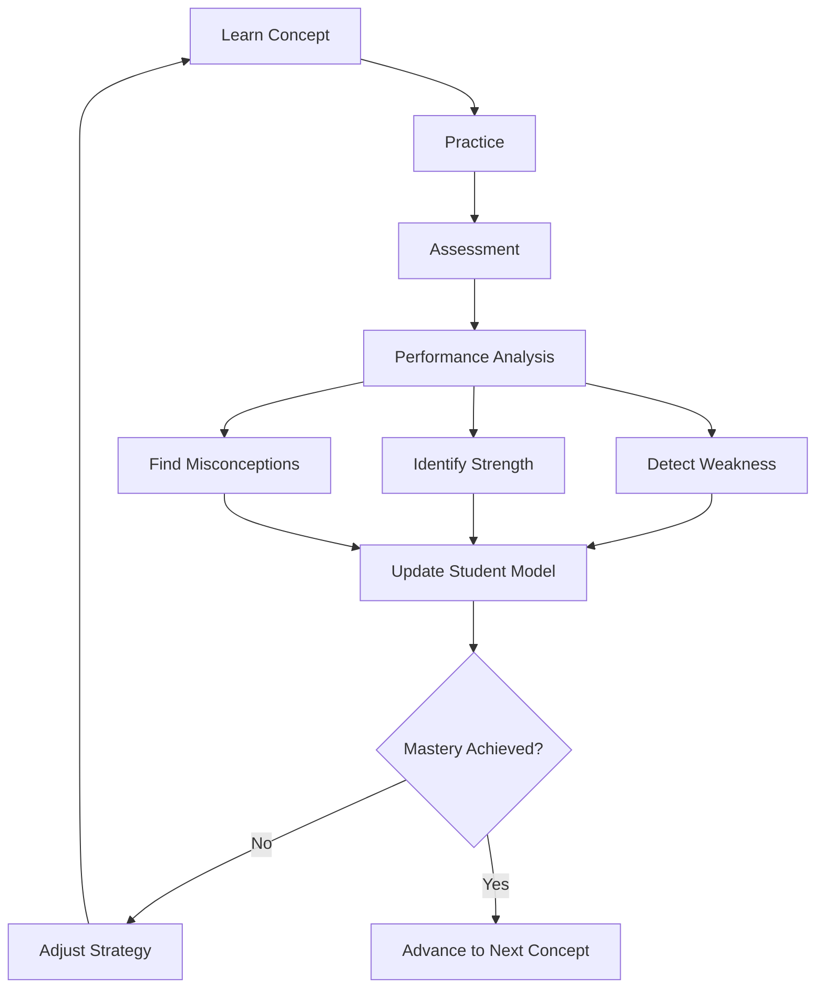

### Adaptation Strategies

| Situation | Adaptation |
|-----------|------------|
| **Struggling with concept** | Simplify explanations, more examples, slower pace |
| **Quick mastery** | Increase difficulty, accelerate pace |
| **Repeated mistakes** | Review prerequisites, change teaching approach |
| **High confidence, low performance** | Address overconfidence, increase assessment |
| **Boredom** | Add challenges, real-world applications |
| **Anxiety** | Provide encouragement, break into smaller steps |

---

## 19. Course Architecture

### Course Structure

```
Course
├── Overview
│   ├── Description
│   ├── Learning Objectives
│   └── Prerequisites
├── Syllabus
│   ├── Topics
│   ├── Schedule
│   └── Resources
├── Content
│   ├── Lecture Notes
│   ├── Readings
│   ├── Videos
│   └── Code Examples
├── Activities
│   ├── Assignments
│   ├── Quizzes
│   ├── Projects
│   └── Exams
├── AI Teacher
│   ├── Chat
│   ├── Practice
│   └── Review
├── Progress
│   ├── Mastery
│   ├── Grades
│   └── Analytics
└── Settings
    ├── Preferences
    ├── Schedule
    └── Notifications
```

### Course Data Model

```typescript
interface Course {
  id: string
  title: string
  description: string
  syllabus: Syllabus
  topics: Topic[]
  resources: Resource[]
  assessments: Assessment[]
  settings: CourseSettings
}

interface Topic {
  id: string
  courseId: string
  title: string
  description: string
  concepts: Concept[]
  resources: Resource[]
  order: number
}

interface Concept {
  id: string
  topicId: string
  title: string
  description: string
  difficulty: 'beginner' | 'intermediate' | 'advanced'
  prerequisites: string[]  // conceptIds
  mastery: number
}
```

---

## 20. Resource Ingestion Pipeline

### Ingestion Flow

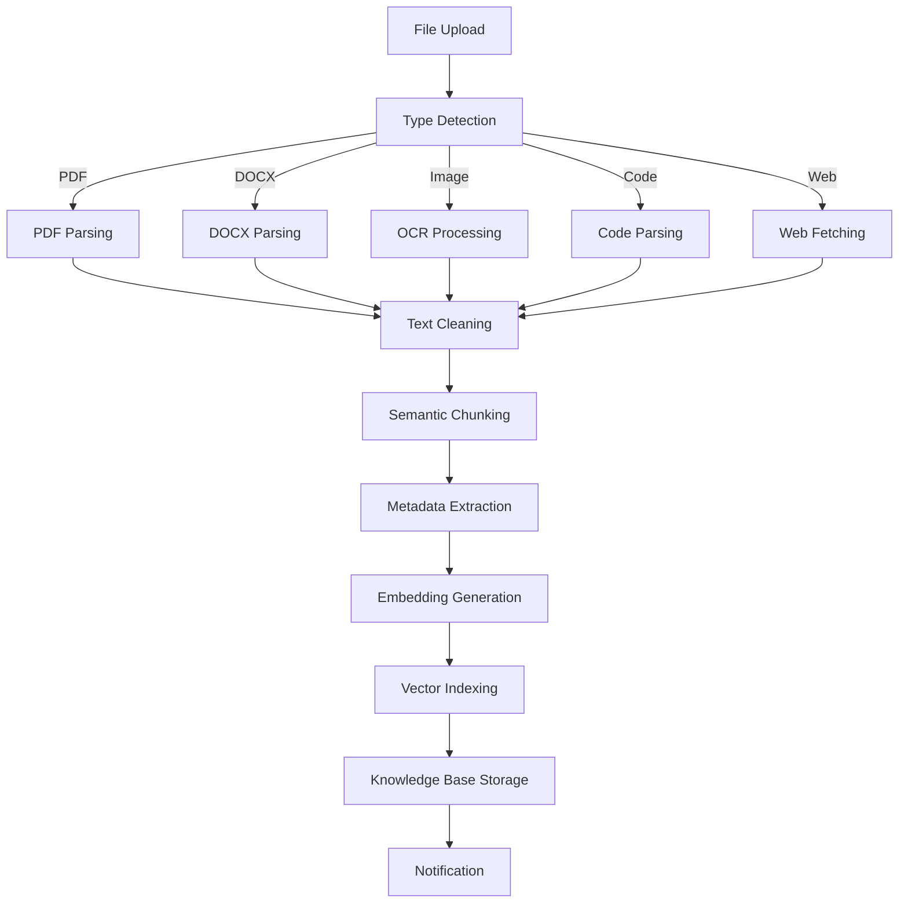

### Supported File Types

| Type | Extensions | Processing |
|------|------------|------------|
| **PDF** | .pdf | pdf.js extraction, OCR if needed |
| **Word** | .docx, .doc | mammoth.js parsing |
| **Text** | .txt, .md | Direct reading |
| **Code** | .py, .js, .ts, .java, .cpp | Syntax-aware parsing |
| **Images** | .png, .jpg | OCR with Tesseract |
| **Slides** | .ppt, .pptx | Text extraction |
| **Web** | URL | Web scraping |

### Chunking Strategy

```typescript
interface Chunk {
  id: string
  resourceId: string
  content: string
  metadata: ChunkMetadata
  embedding: number[]
}

function semanticChunk(text: string, maxTokens: number = 1000): Chunk[] {
  // Split by sections/headings
  const sections = splitBySections(text)
  
  // Further split long sections
  const chunks = sections.flatMap(section => {
    if (tokenCount(section) <= maxTokens) return [section]
    return splitByParagraphs(section, maxTokens)
  })
  
  // Add overlap between chunks
  return addOverlap(chunks, 0.2)
}
```

---

## 21. Coding Tutor Architecture

### Code Analysis Pipeline

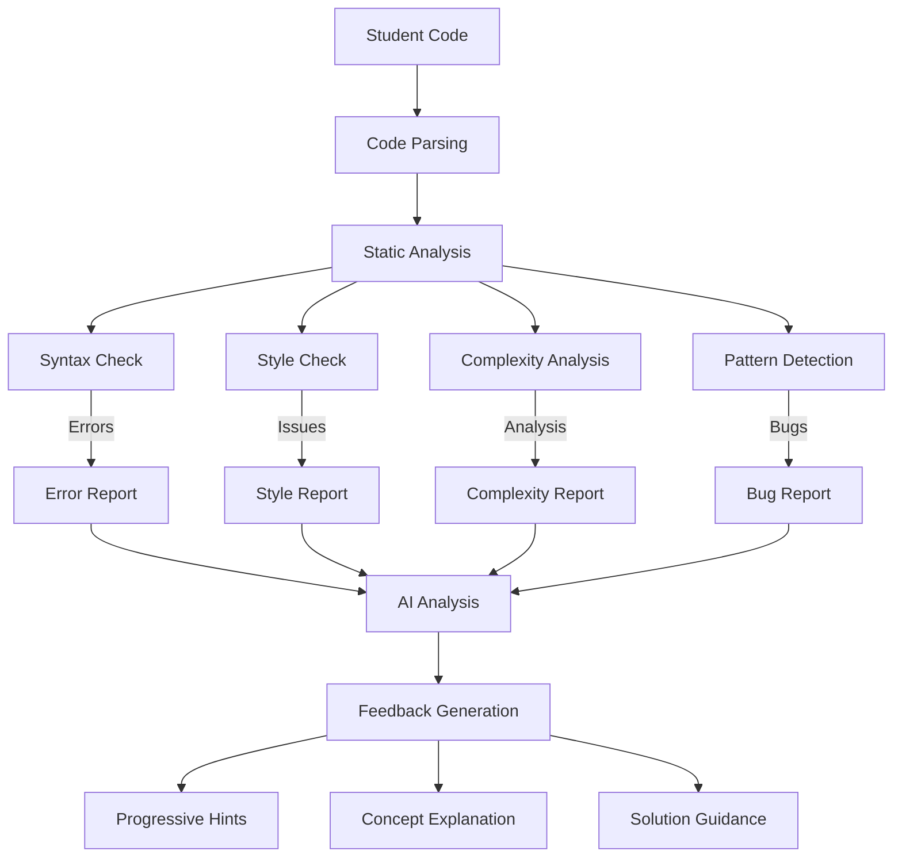

### Code Execution Sandbox

```typescript
interface CodeExecutor {
  execute(code: string, language: Language, input: string): Promise<ExecutionResult>
  runTests(code: string, tests: TestCase[]): Promise<TestResult[]>
  analyzeComplexity(code: string): Promise<ComplexityAnalysis>
}

interface ExecutionResult {
  output: string
  error: string | null
  executionTime: number
  memoryUsage: number
  exitCode: number
}
```

### Progressive Hints System

```typescript
enum HintLevel {
  HINT_1 = 'conceptual_hint',
  HINT_2 = 'approach_hint',
  HINT_3 = 'pseudocode',
  HINT_4 = 'partial_solution',
  HINT_5 = 'full_solution'
}

function generateHint(level: HintLevel, problem: Problem): string {
  switch (level) {
    case HintLevel.HINT_1:
      return `Think about: ${problem.concept}`
    case HintLevel.HINT_2:
      return `Try this approach: ${problem.approach}`
    case HintLevel.HINT_3:
      return `Pseudocode:\n${problem.pseudocode}`
    case HintLevel.HINT_4:
      return `Partial solution:\n${problem.partialSolution}`
    case HintLevel.HINT_5:
      return `Full solution:\n${problem.fullSolution}`
  }
}
```

---

## 22. Assessment Architecture

### Quiz Generation

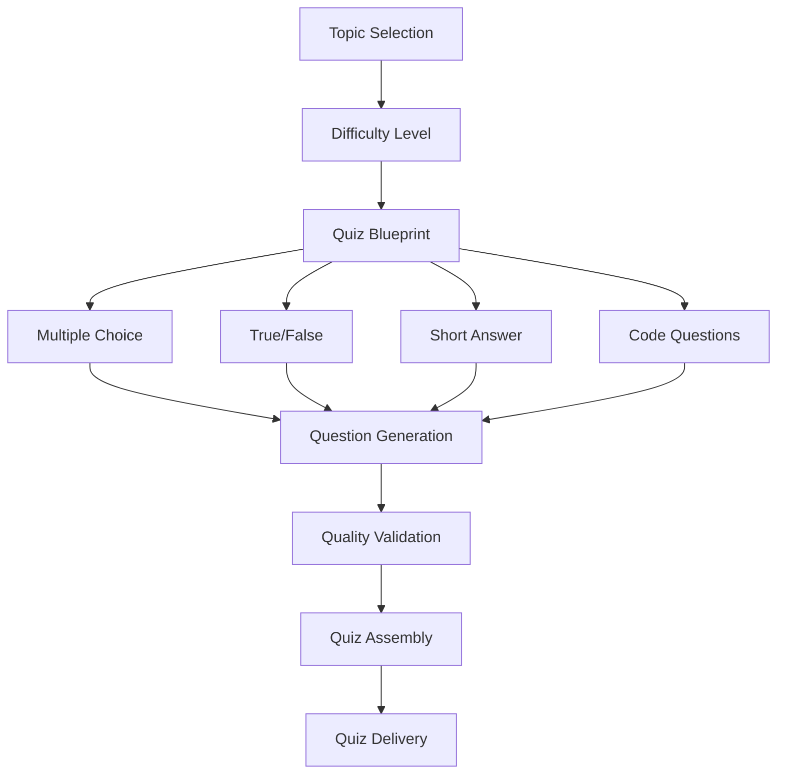

### Question Types

| Type | Description | Grading |
|------|-------------|---------|
| **Multiple Choice** | Select correct answer | Automatic |
| **True/False** | Binary choice | Automatic |
| **Short Answer** | Brief explanation | AI-assisted |
| **Code Writing** | Write code solution | Test cases |
| **Code Debugging** | Fix broken code | Test cases |
| **Concept Mapping** | Relate concepts | Rubric-based |

### Grading System

```typescript
interface GradingSystem {
  gradeQuiz(quiz: Quiz, answers: Answer[]): Promise<QuizResult>
  gradeCode(code: string, tests: TestCase[]): Promise<CodeResult>
  gradeEssay(essay: string, rubric: Rubric): Promise<EssayResult>
  provideFeedback(result: AssessmentResult): Promise<Feedback>
}

interface QuizResult {
  score: number
  correctAnswers: number
  totalQuestions: number
  timeSpent: number
  questionResults: QuestionResult[]
  feedback: Feedback
}
```

---

## 23. Study Planner

### Planner Architecture

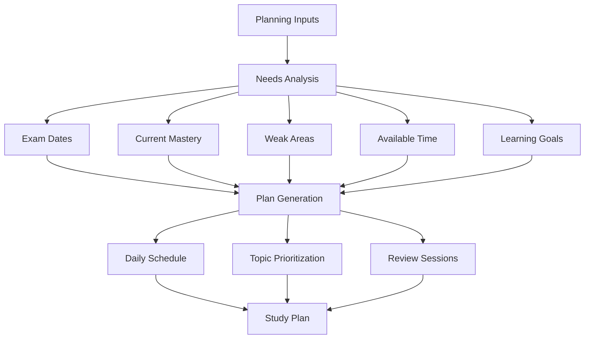

### Plan Generation

```typescript
interface StudyPlan {
  id: string
  studentId: string
  startDate: Date
  endDate: Date
  examDate: Date
  dailyPlans: DailyPlan[]
  priorities: Priority[]
  reviews: ReviewSession[]
}

interface DailyPlan {
  date: Date
  duration: number
  topics: TopicSession[]
  breaks: Break[]
}

interface TopicSession {
  topicId: string
  duration: number
  type: 'learn' | 'practice' | 'review' | 'assess'
  priority: 'high' | 'medium' | 'low'
}
```

---

## 24. Database Architecture

### ER Diagram

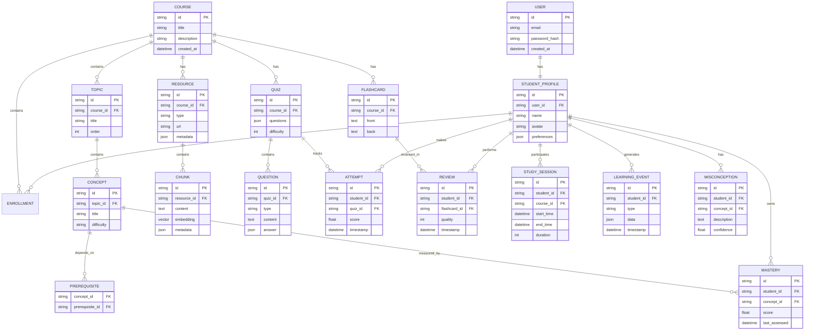

### Key Database Design Decisions

1. **PostgreSQL as primary database**
   - Relational data with complex relationships
   - pgvector for embeddings
   - JSONB for flexible metadata
   - Strong consistency guarantees

2. **Redis for caching and sessions**
   - Conversation memory
   - Hot data caching
   - Rate limiting
   - Job queues

3. **Object storage for files**
   - S3-compatible
   - PDF, images, documents
   - Versioned storage
   - CDN integration

---

## 25. API Architecture

### RESTful API Design

#### Authentication Endpoints

```
POST /api/auth/register
POST /api/auth/login
POST /api/auth/logout
POST /api/auth/refresh
GET  /api/auth/session
```

#### User Endpoints

```
GET    /api/users/:id
PUT    /api/users/:id
GET    /api/users/:id/preferences
PUT    /api/users/:id/preferences
```

#### Course Endpoints

```
GET    /api/courses
POST   /api/courses
GET    /api/courses/:id
PUT    /api/courses/:id
DELETE /api/courses/:id
POST   /api/courses/:id/enroll
GET    /api/courses/:id/topics
POST   /api/courses/:id/topics
GET    /api/courses/:id/resources
```

#### Teacher Endpoints

```
POST   /api/teacher/chat
POST   /api/teacher/explain
POST   /api/teacher/practice
POST   /api/teacher/quiz
POST   /api/teacher/evaluate
POST   /api/teacher/hints
GET    /api/teacher/sessions
```

#### Resource Endpoints

```
POST   /api/resources/ingest
GET    /api/resources/search
GET    /api/resources/:id
GET    /api/resources/:id/chunks
DELETE /api/resources/:id
```

#### Student Endpoints

```
GET    /api/student/progress
GET    /api/student/mastery
GET    /api/student/recommendations
GET    /api/student/mistakes
GET    /api/student/history
```

#### Assessment Endpoints

```
GET    /api/quizzes/:id
POST   /api/quizzes/:id/submit
GET    /api/flashcards
POST   /api/flashcards/review
POST   /api/assignments/:id/submit
GET    /api/exams/generate
```

### API Response Format

```typescript
interface APIResponse<T> {
  success: boolean
  data: T
  error?: {
    code: string
    message: string
    details?: any
  }
  meta?: {
    timestamp: Date
    pagination?: Pagination
  }
}
```

### Error Handling

```typescript
enum ErrorCode {
  UNAUTHORIZED = 'unauthorized',
  NOT_FOUND = 'not_found',
  VALIDATION_ERROR = 'validation_error',
  RATE_LIMITED = 'rate_limited',
  INTERNAL_ERROR = 'internal_error',
  AI_ERROR = 'ai_error',
  RESOURCE_ERROR = 'resource_error'
}
```

---

## 26. Authentication and Authorization

### Authentication Flow

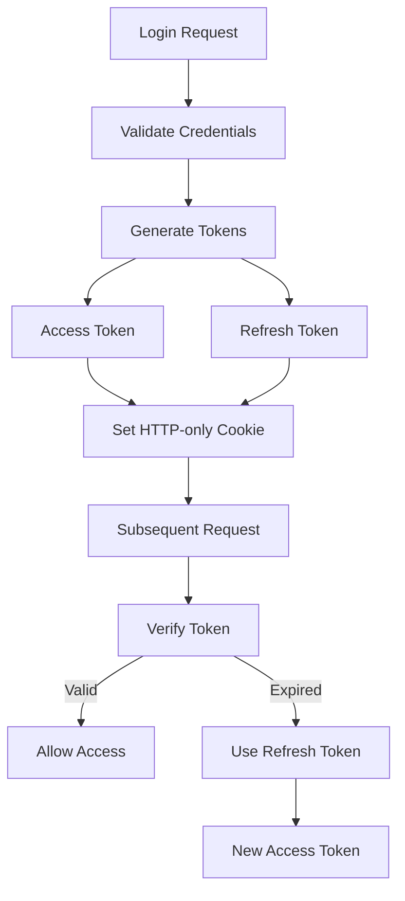

### Authorization Levels

| Role | Permissions |
|------|-------------|
| **Student** | View courses, take quizzes, use AI teacher |
| **Teacher** | Create courses, upload resources, view analytics |
| **Admin** | Full system access, user management |

### Security Measures

1. **Password hashing** with bcrypt
2. **JWT tokens** with short expiration
3. **HTTP-only cookies** for token ... (30 KB left)